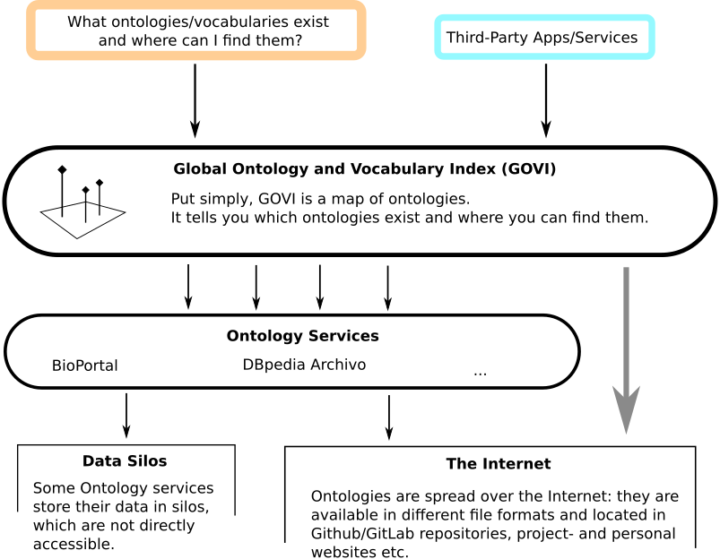

# Global Ontology and Vocabulary Index (GOVI)

The Global Ontology and Vocabulary Index (GOVI) is meant to be a Community-driven project to maintain an index of all available RDF ontologies and vocabularies.
The index is basically a big file ([CSV](https://en.wikipedia.org/wiki/Comma-separated_values), [JSON Lines](https://jsonlines.org/), ...), containing a list of URLs to ontologies and vocabularies, plus a few meta data (such as authors, license information and latest modification date).

---

## Overview

- [Global Ontology and Vocabulary Index (GOVI)](#global-ontology-and-vocabulary-index-govi)
  - [Overview](#overview)
  - [Summary of the content of the index](#summary-of-the-content-of-the-index)
  - [Why this project?](#why-this-project)
  - [How to contribute?](#how-to-contribute)
    - [Add/change ontology entry](#addchange-ontology-entry)
    - [Add/change source code](#addchange-source-code)
  - [Documentation](#documentation)
  - [License](#license)

---

## Summary of the content of the index

An RDF ontology (including vocabularies) is part of the index if it meets the following criteria:
* non-empty, valid ontology title
* non-empty, valid ontology IRI
* at least one valid URL to a RDF file is available (JSON-LD, N3, Ntriples, RDF/XML or Turtle)
* at least one instance/subclass of one of the following classes were found: `owl:Ontology`, `owl:Class`, `rdf:Property`, `rdfs:Class`, `skos:Concept`

If an entry is part of multiple sources (e.g. LOV and DBpedia Archivo), the one which appears first is taken.

**The index is provided in different file formats:**

| CSV File                 | JSON Lines File              |
|--------------------------|------------------------------|
| [index.csv](./index.csv) | [index.jsonl](./index.jsonl) |

## Why this project?

Where do you go if you wanna answer the following question:

> **What ontologies/vocabularies exist and where can I find them?**

Currently, there is **no** search engine or list of all ontologies/vocabularies on the Internet.
Such a list may never exist because ontologies/vocabularies often change (because of [link rot](https://en.wikipedia.org/wiki/Link_rot) etc.).
To answer this question, one must manually search various services such as ontology portals and archive services, which only cover a part of the ontologies/vocabularies.
This project aims to provide a simple list of RDF ontologies/vocabularies.
The list was created by gathering information from various services, such as DBpedia Archivo.
**We are building on the hard work of the teams behind these services.**
People can also contribute metadata through this repository, but it is recommended to use appropriate services instead.
Over time, this place could encompass almost all ontologies/vocabularies.

**Why another service? Why don't you just add the ontologies at DBpedia Archivo (or others)?**

Services such as BioPortal and DBpedia Archivo play an important role for the community because they provide user-friendly access to browse ontologies and provide additional services such as versioning, archives, etc.
This project is **not** meant to replace them, on the contrary, we support services like [DBpedia Archivo](https://archivo.dbpedia.org/) because they address important challenges like link rot and inconsistent versioning.
But they all have some relevante limitations.

Portals such as BioPortal are also important because of their user-friendly approach (e.g. browsing class hierarchies, searching, etc.).
But portals often provide ontologies as a data dump or SPARQL endpoint instead of a dereferenceable URL (for accessing the RDF/OWL code).
As long as the portal is online, everything is fine, but as soon as it goes offline, all ontologies/vocabularies are gone unless there is a copy somewhere else.

One disadvantage of DBpedia is the fact that only the ontology file provided is evaluated.
As an outsider, you cannot add any further information to an ontology entry.
For example, it sometimes happened that license information was only displayed in the associated Github repository, but not in the ontology file itself.
In these cases, it would not be possible to add this metadata to the ontology entry on DBpedia Archivo.

We want to complement these services so in the end users have an as complete as possible ontology map.

## How to contribute?

There are various ways to contribute:
1. Add/change ontology entry
2. Add/change source code

### Add/change ontology entry

The index mostly consists of metadata read from an ontology service such as DBpedia Archivo.
However, not all ontologies are registered in an ontology service and therefore need to be maintained manually.
Before you continue, please try to submit your ontology to [DBpedia Archivo](https://archivo.dbpedia.org/add).
Not only will the ontology be added to this index as well (in the next run) but it is also less work and the ontology gets versioned etc.

If that is not feasible, adapt the file [manually-maintained-metadata-about-ontologies.csv](./manually-maintained-metadata-about-ontologies.csv).
It has the same structure as the [index.csv](./index.csv) and its entries are only inserted at the end of the generation process.
If you need any assistance, don't hesistate to open an issue or contact me (contact details at https://github.com/k00ni).

### Add/change source code

For source code changes use Pull Requests on Github.
Further information can be found here: https://docs.github.com/en/pull-requests/collaborating-with-pull-requests/proposing-changes-to-your-work-with-pull-requests/creating-a-pull-request

## Documentation

Further information can be found in [doc](./doc/) folder.

## License

Copyright (C) 2024 [Konrad Abicht](https://inspirito.de) and contributors.

The code and development material (e.g. documentation) of GOVI is licenced under the terms of the [GNU GPL v2](./LICENSE).

The content of the [index.csv](./index.csv) and [manually-maintained-metadata-about-ontologies.csv](./manually-maintained-metadata-about-ontologies.csv) is licenced under the terms of the [CC0 1.0 DEED (Public Domain)](https://creativecommons.org/publicdomain/zero/1.0/), because it only contains content which was already published on the Internet.
The rights of the ontology/vocabulary authors shall remain reserved.
